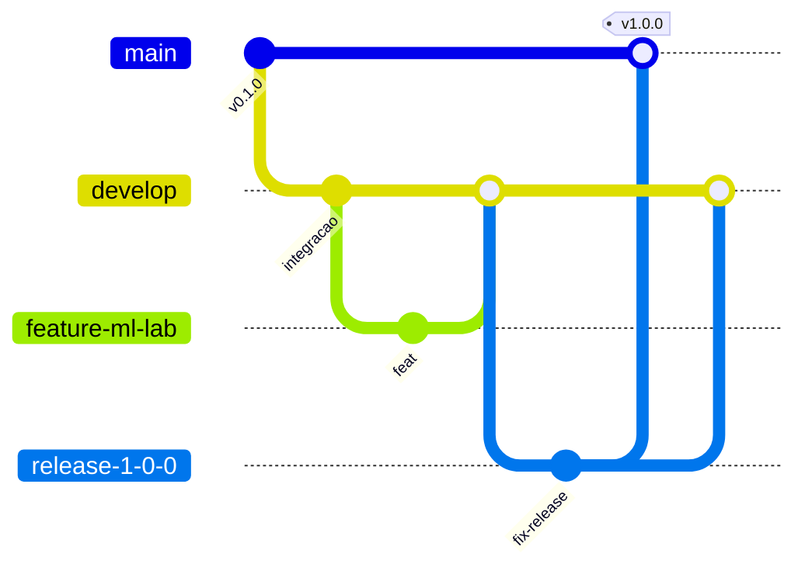

# Git Flow — branches e releases

Este repositório segue [Git Flow](https://nvie.com/posts/a-successful-git-branching-model/) com automação via GitHub Actions.

## Branches

| Branch | Propósito | Quem mergeia |
|--------|-----------|--------------|
| `main` | **Produção** — código estável em produção | Somente **@ilaraca** aprova PRs de `release/*` ou `hotfix/*` |
| `develop` | **Integração** — próxima release | Colaboradores via PR (após CI verde) |
| `release/X.Y.Z` | Estabilização antes de produção | Maintainer ou colaborador com acesso |
| `feature/*` | Nova funcionalidade | Colaboradores → PR para `develop` |
| `hotfix/*` | Correção urgente em produção | PR para `main` (aprovação @ilaraca) |

## Fluxo visual

> No diagrama, hífens substituem barras (`feature-ml-lab` = `feature/ml-lab`) — exigência de sintaxe do Mermaid.



## Para colaboradores (fork / feature)

```bash
# 1. Fork no GitHub, clone e configure upstream
git remote add upstream https://github.com/ilaraca/3d-colab-recommendations.git

# 2. Partir de develop
git fetch upstream
git checkout -b feature/minha-feature upstream/develop

# 3. Commits semânticos
git commit -m "feat(learn): adiciona painel de vetores"

# 4. Push no seu fork e abrir PR → develop
git push origin feature/minha-feature
```

**Não abra PR direto para `main`.** O workflow `Git Flow Guard` bloqueia.

## Para o maintainer (@ilaraca)

### Iniciar uma release

**Opção A — GitHub Actions (recomendado)**

1. Acesse **Actions → Start Release → Run workflow**
2. Informe a versão semver (ex: `1.0.0`)
3. O workflow cria `release/1.0.0` e abre PR → `main`

**Opção B — manual**

```bash
git checkout develop
git pull origin develop
git checkout -b release/1.0.0
git push -u origin release/1.0.0
# Abrir PR release/1.0.0 → main no GitHub
```

### Publicar em produção

1. Revise o PR `release/X.Y.Z` → `main`
2. Aprove como code owner (obrigatório — `.github/CODEOWNERS`)
3. Merge o PR
4. **Automático:** workflow `Release` cria tag `vX.Y.Z` e GitHub Release

### Hotfix urgente

```bash
git checkout main
git pull origin main
git checkout -b hotfix/1.0.1
# corrigir, commit, push
git push -u origin hotfix/1.0.1
# PR hotfix/1.0.1 → main (aprovação @ilaraca)
# Depois: PR hotfix/1.0.1 → develop (back-merge)
```

## Workflows

| Workflow | Gatilho | Função |
|----------|---------|--------|
| `CI` | PR e push em `develop`/`release/*` | lint, testes, build |
| `Git Flow Guard` | Todo PR | Valida origem/destino das branches |
| `Release` | Merge em `main` vindo de `release/*` ou `hotfix/*` | Cria tag + GitHub Release |
| `Start Release` | Manual (`workflow_dispatch`) | Cria branch release e PR → main |

## Proteção de branches (setup único)

Execute uma vez com [GitHub CLI](https://cli.github.com/) autenticado:

```bash
chmod +x scripts/setup-branch-protection.sh
./scripts/setup-branch-protection.sh
```

Isso configura:

- **`main`**: PR obrigatório, CI verde, review de code owner (@ilaraca), sem push direto
- **`develop`**: PR obrigatório, CI verde, 1 aprovação
- **`release/*`**: PR obrigatório, CI verde (quando suportado pelo plano GitHub)

> Forks externos não precisam de permissão especial: basta abrir PR para `develop`. Somente merges em `main` exigem sua aprovação.

## Convenção de tags

- Formato: `vMAJOR.MINOR.PATCH` (ex: `v1.0.0`)
- Criadas automaticamente ao merge de `release/X.Y.Z` ou `hotfix/X.Y.Z` em `main`
- Listadas em [Releases](https://github.com/ilaraca/3d-colab-recommendations/releases)

## Commits semânticos

```
feat(escopo): descrição
fix(escopo): descrição
chore(escopo): descrição
docs(escopo): descrição
test(escopo): descrição
```

Exemplos: `feat(learn): adiciona quiz`, `fix(recommendations): corrige score ML`
