# Sistema de Recomendações — 3D Colab

Documentação completa do sistema de recomendação do marketplace 3D Colab: **para que serve**, **como as fases funcionam**, **como usar o laboratório interativo** e **fluxogramas** de cada etapa do pipeline.

> Pipeline base: **contexto → encode → dataset → treino → inferência → ranking**

---

## Índice

1. [Para que serve o projeto](#1-para-que-serve-o-projeto)
2. [Conceitos essenciais](#2-conceitos-essenciais)
3. [Visão geral da arquitetura](#3-visão-geral-da-arquitetura)
4. [Fase 1 — Content-based (implementada)](#4-fase-1--content-based-implementada)
5. [Fase 2 — Rede neural (implementada)](#5-fase-2--rede-neural-implementada)
6. [Fase 3 — Avançada (planejada)](#6-fase-3--avançada-planejada)
7. [Laboratório interativo `/learn`](#7-laboratório-interativo-learn)
8. [Como rodar e testar](#8-como-rodar-e-testar)
9. [Estrutura de código](#9-estrutura-de-código)
10. [Referências](#10-referências)

---

## 1. Para que serve o projeto

### O problema

Um marketplace de produtos 3D lista dezenas (ou milhares) de itens. Sem personalização, todo usuário vê a **mesma ordem**: mais recentes, mais baratos, ordem alfabética. Quem gosta de vasos decorativos e quem procura peças funcionais recebem exatamente a mesma vitrine.

### A solução

Este projeto demonstra **três formas crescentes de personalizar** essa vitrine, usando o histórico de compras e os atributos dos produtos.

### O duplo objetivo

| Objetivo | Descrição |
|----------|-----------|
| **Produto** | Marketplace 3D funcional com recomendações personalizadas |
| **Educacional** | Laboratório interativo para aprender machine learning com TensorFlow.js na prática |

O segundo objetivo é o que diferencia este repositório: além de *usar* recomendação, ele **expõe o processo** — vetores, dataset, treino, métricas — numa interface visual em `/learn`.

### Público-alvo

- Estudantes de pós-graduação aprendendo sistemas de recomendação
- Desenvolvedores que querem entender ML aplicado sem abstrações mágicas
- Apresentações e demos ao vivo (3 personas com comportamentos distintos)

### Escopo do dataset demo

| Item | Quantidade |
|------|-----------|
| Produtos | 20 |
| Makers (vendedores) | 4 |
| Compradores com histórico | 2 (Maria e João) |
| Categorias | 6 (decorative, functional, educational, figure, prototype, part) |
| Materiais | 5 (PLA, ABS, PETG, TPU, Resina) |

> **Importante:** o volume é propositalmente pequeno para ser didático. Isso torna o *overfit* visível no laboratório — um recurso pedagógico, não um defeito.

---

## 2. Conceitos essenciais

Antes dos fluxogramas, quatro ideias que aparecem em todas as fases.

### Vetor

Uma **lista de números** que representa um produto ou um usuário. É como uma ficha resumida que o computador consegue comparar matematicamente.

```
Vaso Geométrico → [0.02, 0.09, 0.01, 0.00, 0.01, 0.35, 0, 0, 0, 0, 0, 0.25, 0, 0, 0, 0]
                   └──── numéricos ────┘ └── categoria ──┘ └──── material ────┘
```

### Encode

O processo de **transformar** um produto (ou usuário) em vetor. No projeto, `encode.ts` faz isso com regras explícitas.

### Similaridade de cosseno

Medida de **quão parecidos** são dois vetores, entre `0` (nada a ver) e `1` (idênticos em direção). Não mede tamanho, mede **direção** — por isso funciona bem com pesos diferentes.

### Label (rótulo)

Na Fase 2, cada par `(usuário, produto)` recebe um rótulo:

- **1** = o usuário comprou
- **0** = o usuário não comprou

É com esses exemplos que a rede neural aprende.

---

## 3. Visão geral da arquitetura

### Camadas do sistema

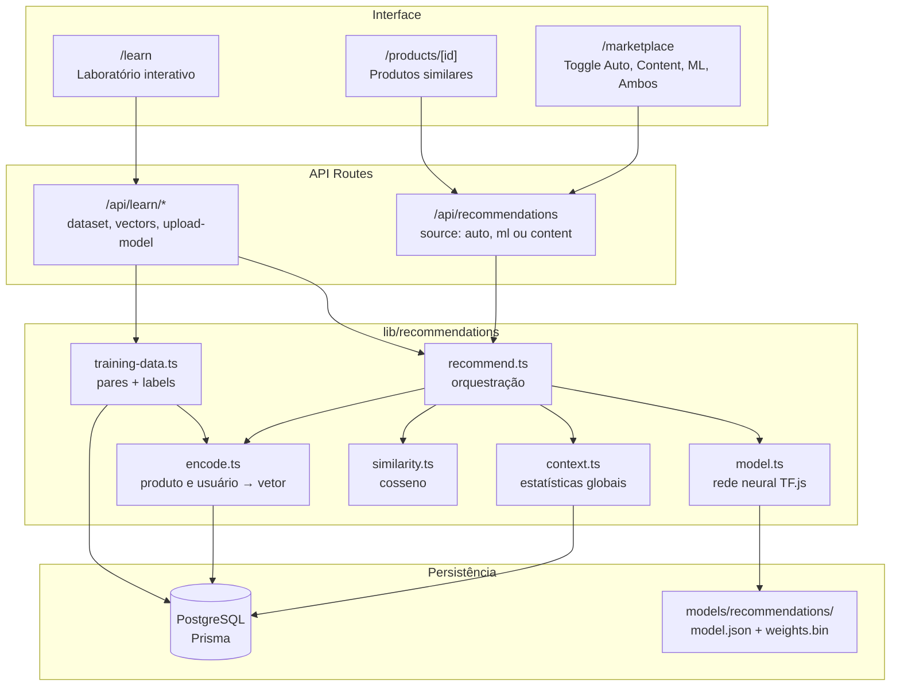

### Fluxo de decisão da API

Quando alguém pede recomendações, o sistema escolhe o algoritmo assim:

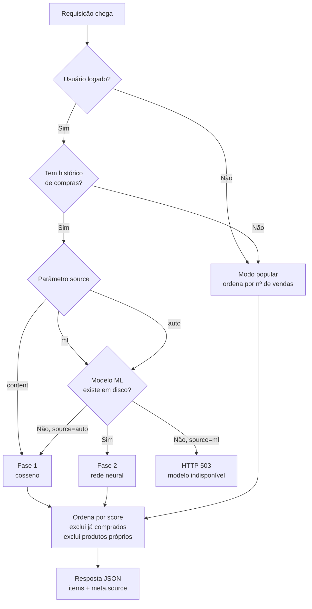

### Status das fases

| Fase | Objetivo | Status | Complexidade | Docs |
|------|----------|--------|--------------|------|
| **1** | Content-based (cosseno) | ✅ Implementada | Baixa | [Plano](./phase-01-content-based/plan.md) · [Spec](./phase-01-content-based/spec.md) |
| **2** | Rede neural (TensorFlow.js) | ✅ Implementada | Média | [Plano](./phase-02-neural-network/plan.md) · [Spec](./phase-02-neural-network/spec.md) |
| **3** | Embeddings, two-tower, colaborativa | 📋 Planejada | Alta | [Plano](./phase-03-advanced/plan.md) · [Spec](./phase-03-advanced/spec.md) |

---

## 4. Fase 1 — Content-based (implementada)

### A ideia em uma frase

> Transforme cada produto em uma lista de números, faça a média do que o usuário comprou, e recomende os produtos com a lista mais parecida.

### Por que começar aqui

- **Não precisa treinar** — funciona no primeiro dia, com um único pedido no banco
- **Totalmente explicável** — dá para apontar exatamente por que um produto foi sugerido
- **Serve de baseline** — a Fase 2 precisa provar que é melhor que isto

### Pipeline completo

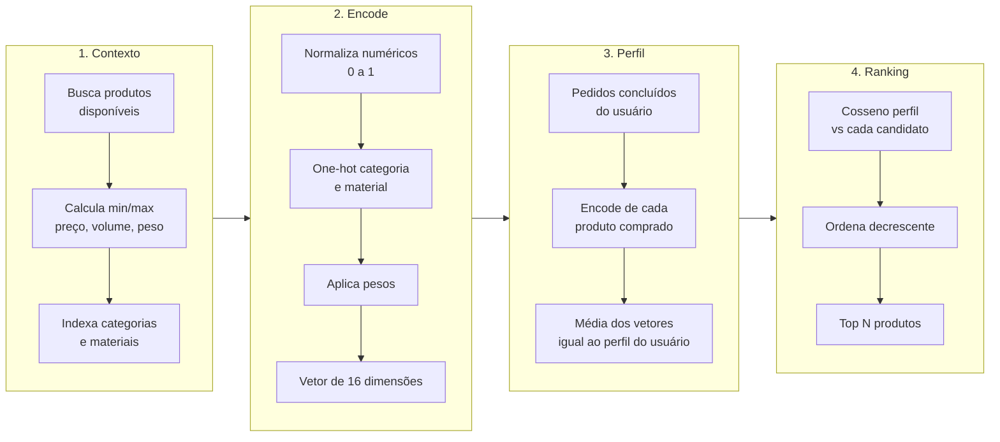

### Como o vetor é montado

O vetor tem **16 dimensões** com o seed atual:

| Posição | Feature | Peso | Origem |
|---------|---------|------|--------|
| 0 | `price` | 0.15 | Normalizado entre min e max do catálogo |
| 1 | `avgRating` | 0.10 | Média das reviews, escala 0–5 |
| 2 | `printTime` | 0.05 | Horas de impressão, normalizado |
| 3 | `volume` | 0.05 | largura × altura × profundidade |
| 4 | `weight` | 0.05 | Peso em kg, normalizado |
| 5–10 | `category` | 0.35 | One-hot: 6 categorias |
| 11–15 | `material` | 0.25 | One-hot: 5 materiais |

**Categoria e material somam 60% do peso** — por isso a similaridade é dominada por "que tipo de produto é" e "de que material é feito".

### Exemplo concreto: Maria

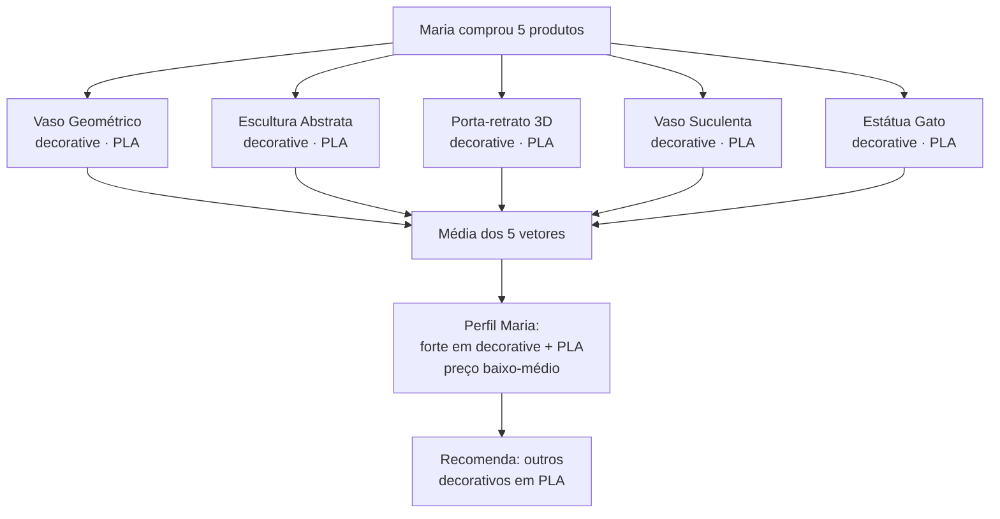

João tem o comportamento oposto (funcional/educacional, ABS/TPU) e recebe um ranking completamente diferente — o que torna a demo ao vivo convincente.

### Regras de exclusão

O ranking sempre remove:

- Produtos que o usuário **já comprou**
- Produtos do **próprio usuário** (se ele for maker)
- IDs passados em `excludeIds`
- No modo `similar`, o **próprio produto** de referência

### Fallback: usuário sem histórico

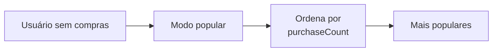

Isso resolve o **cold start** de usuário: quem acabou de se cadastrar vê os produtos mais vendidos.

### Onde aparece na UI

| Local | Componente | Comportamento |
|-------|-----------|---------------|
| `/marketplace` | `RecommendationsSection` | "Recomendados para você" ou "Mais populares" |
| `/products/[id]` | `SimilarProducts` | 4 produtos similares ao atual |

---

## 5. Fase 2 — Rede neural (implementada)

### A ideia em uma frase

> Em vez de assumir que "parecido = bom", mostre à máquina centenas de exemplos de "comprou / não comprou" e deixe que ela aprenda o padrão.

### O que muda em relação à Fase 1

| Aspecto | Fase 1 | Fase 2 |
|---------|--------|--------|
| Regra de decisão | Fixa (cosseno) | Aprendida (pesos da rede) |
| Entrada | Vetor do usuário **vs** vetor do produto | Vetor do usuário **+** vetor do produto concatenados |
| Saída | Similaridade 0–1 | Probabilidade de compra 0–1 |
| Precisa treinar | Não | Sim (`npm run recommendations:train`) |
| Dimensão de entrada | 16 | 32 (16 + 16) |
| Explicabilidade | Alta | Baixa |

### Pipeline de treino

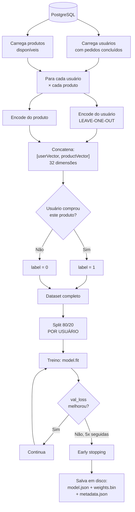

### Leave-one-out: a correção importante

O demo original do curso tinha um **vazamento de dados** (*data leakage*). Este projeto corrige isso.

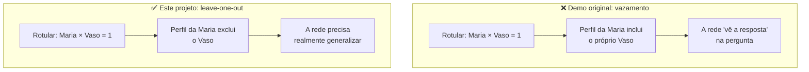

Se o usuário comprou **apenas um** produto e ele é o rotulado, o perfil vira um **vetor cold start** (todos zeros) — evitando divisão por zero e mantendo o exemplo válido.

### Split por usuário (não por linha)

O dataset é dividido **por usuário**, não aleatoriamente por par:

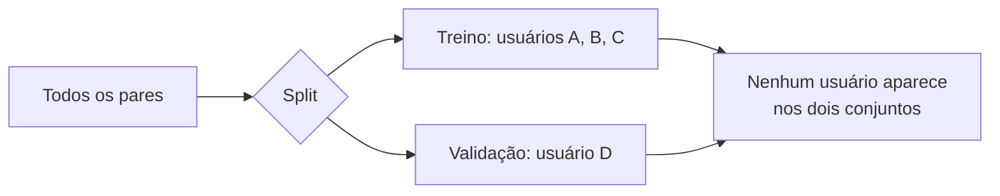

Se o split fosse aleatório por linha, o mesmo usuário apareceria no treino e na validação — a métrica ficaria otimista demais.

### Arquitetura da rede

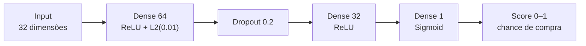

| Hiperparâmetro | Valor | Por quê |
|----------------|-------|---------|
| Otimizador | Adam, lr 0.01 | Convergência rápida em datasets pequenos |
| Loss | `binaryCrossentropy` | Classificação binária (comprou/não) |
| Épocas | 50 (máx) | Com early stopping |
| Batch size | 32 | Padrão para datasets pequenos |
| Early stopping | patience 5 em `val_loss` | Evita overfit |
| Regularização | L2 0.01 + Dropout 0.2 | Poucos dados → alto risco de memorização |

> A rede é **menor** que a do demo original (128→64→32) justamente porque o volume de dados aqui é pequeno.

### Pipeline de inferência

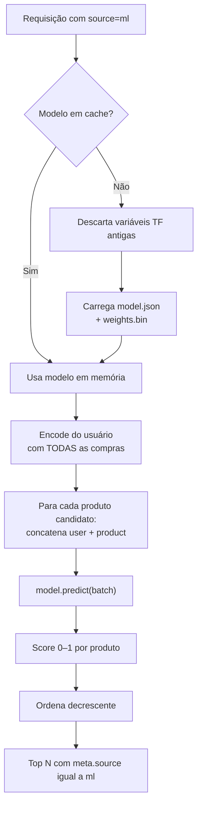

Na inferência o perfil usa **todas** as compras (não há leave-one-out) — leave-one-out existe só para o treino não trapacear.

### Detalhe técnico: TensorFlow no Node

O projeto usa **`@tensorflow/tfjs`** (JavaScript puro) em vez de `@tensorflow/tfjs-node`:

- `tfjs-node` exige compilação de binários nativos, que falha em algumas combinações de Node/SO
- `tfjs` puro funciona em qualquer ambiente, com treino mais lento (irrelevante para 40 exemplos)
- Para acelerar, é possível instalar `tfjs-node` e rodar com `TFJS_USE_NODE=1`

O carregamento do modelo faz `dispose()` das variáveis anteriores antes de recarregar, evitando o erro `Variable with name dense_Dense1/kernel was already registered` durante hot reload do Next.js.

### Métricas registradas

Cada treino grava `metadata.json`:

```json
{
  "version": "2026-08-01T23:59:57.832Z",
  "trainedAt": "2026-08-01T23:59:57.831Z",
  "trainExamples": 20,
  "valExamples": 20,
  "finalTrainLoss": 0.469,
  "finalValLoss": 0.771,
  "finalValAccuracy": 0.75,
  "inputDimension": 32,
  "epochsRun": 11,
  "completedOrderStatuses": ["completed", "delivered", "shipped"]
}
```

### Limitação honesta

Com **2 compradores** e **20 produtos**, o dataset tem ~40 pares. A rede memoriza rapidamente. Isso é **intencional no contexto educacional**: permite ver `val_loss` subindo enquanto `loss` cai — o exemplo clássico de overfit — em segundos, no navegador.

---

## 6. Fase 3 — Avançada (planejada)

Ainda **não implementada**. Documentada em [phase-03-advanced](./phase-03-advanced/plan.md) e dividida em três blocos.

### Visão do ranker híbrido

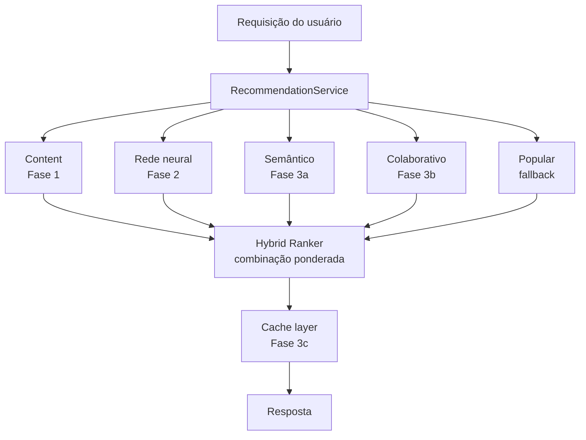

### 3a — Embeddings semânticos

Em vez de features escolhidas à mão, um modelo pré-treinado lê o **texto** do produto e gera um vetor de ~384 dimensões que captura **significado**.

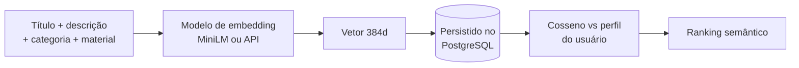

**Diferença prática:** "Engrenagem Educacional" e "Quebra-cabeça 3D" têm categorias diferentes (o cosseno da Fase 1 os separa), mas descrições semanticamente próximas — o embedding os aproxima.

**Ponto-chave:** o vetor é **calculado uma vez e guardado**, não recalculado a cada requisição.

### 3b — Two-tower e filtragem colaborativa

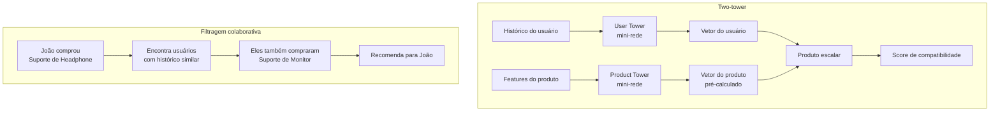

**Por que two-tower:** na Fase 2, cada par `(usuário, produto)` passa pela rede inteira. Com milhares de produtos isso não escala. No two-tower, o vetor de cada produto é calculado **antes** e apenas comparado na hora da busca.

**Por que colaborativa não funciona na demo:** com 2 compradores não há "usuários parecidos" suficientes. Precisa de ≥50 usuários ativos.

### 3c — Cache e busca vetorial

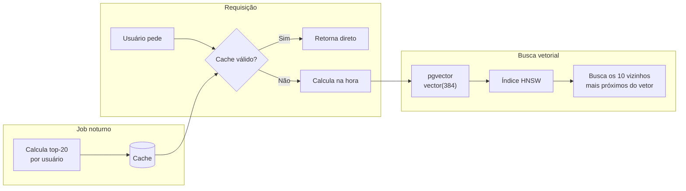

**pgvector** é uma **extensão do PostgreSQL** — não um banco separado. Permite guardar vetores nativamente e buscar os mais próximos com índice ANN (Approximate Nearest Neighbor), sem comparar com todos os itens.

Com 20 produtos, busca linear já é instantânea. pgvector só se justifica com milhares de itens.

### Pré-requisitos que a demo ainda não atende

| Requisito | Necessário | Atual |
|-----------|-----------|-------|
| Catálogo | > 200 produtos | 20 |
| Usuários com histórico | ≥ 50 | 2 |
| Descrições ricas | > 100 chars médio | ~40 chars |

Por isso a Fase 3 permanece como **trabalho futuro** documentado, e não como código.

---

## 7. Laboratório interativo `/learn`

A rota **http://localhost:3000/learn** é a camada educacional do projeto. Ela expõe cada etapa do pipeline numa interface visual, usando **os mesmos dados** do marketplace.

### Mapa do laboratório

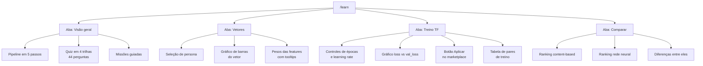

### Roteiro sugerido de aprendizado

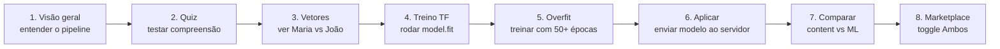

### Aba 1 — Visão geral

Apresenta o pipeline em cinco cartões (contexto → encode → dataset → treino → inferência) e traz dois recursos de acompanhamento:

#### Quiz em 4 trilhas (44 perguntas)

Cada trilha é corrigida separadamente, exige **70% de acertos** para ser aprovada e mostra a explicação de cada alternativa depois da correção. O progresso fica no `localStorage`, e há um botão para refazer uma trilha isolada.

| Trilha | Perguntas | O que cobre |
|--------|-----------|-------------|
| **Analogias** | 11 | Biblioteca, ficha resumida, prova de adivinhação, receita com temperos, médico em formação, compatibilidade de perfis, cardápio do dia, lista telefônica |
| **Vocabulário** | 12 | encode, one-hot, normalizar, cosseno, label, época, learning rate, `loss` vs `val_loss`, sigmoid, dropout, cold start, overfit |
| **Métodos — Fase 1** | 9 | `buildContext`, `normalize`, `oneHotWeighted`, `encodeProduct`, `encodeUserFromPurchases`, `cosineSimilarity` |
| **Métodos — Fase 2** | 12 | `createTrainingData`, `encodeUserLeaveOneOut`, `splitByUser`, `createModel`, `trainRecommendationModel`, `predictBatch`, `scoreProductsML` |

A progressão é intencional: as **analogias** dão a intuição, o **vocabulário** liga a intuição aos termos que aparecem na tela, e as duas trilhas de **métodos** descem ao nível das funções do código — incluindo detalhes que costumam passar batido, como o `|| 1` que evita divisão por zero em `normalize` e o motivo de a inferência *não* usar leave-one-out.

Exemplos de pergunta, uma de cada trilha:

| Trilha | Pergunta |
|--------|----------|
| Analogias | Na analogia da receita, o cozinheiro prova 100 pratos e ajusta os temperos. O que são os "temperos" na rede neural? |
| Vocabulário | Um produto é da categoria `decorative`, entre 6 possíveis. Como o one-hot representa isso? |
| Métodos — Fase 1 | Em `buildContext`, `dimensions` vale `5 + numCategories + numMaterials`. Por que o 5? |
| Métodos — Fase 2 | Por que `splitByUser` divide o dataset por usuário em vez de sortear linhas? |

> As alternativas são rotacionadas por um deslocamento derivado do `id` da pergunta, para que a resposta certa não fique sempre na mesma posição. A rotação é determinística, então as respostas salvas continuam valendo depois de recarregar a página.

#### Missões guiadas (8)

Progresso salvo no `localStorage`:

| Missão | Como completar |
|--------|---------------|
| Explorar vetores | Abrir a aba Vetores |
| Comparar Maria e João | Visualizar as duas personas |
| Treinar no browser | Executar um treino |
| Content vs ML | Abrir o comparador |
| Detectar overfit | Treinar com ≥50 épocas |
| Aplicar no marketplace | Enviar o modelo treinado |
| Quiz do pipeline | Ser aprovado em uma trilha |
| Quiz completo | Ser aprovado nas quatro trilhas |

### Aba 2 — Vetores

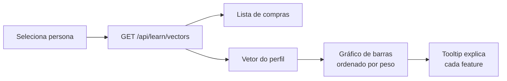

O que observar:

- **Maria** tem barra alta em `category:decorative` e `material:pla`
- **João** tem barra alta em `category:functional` e `material:abs`
- Passar o mouse sobre o nome da feature mostra a explicação
- Os pesos (`category: 0.35`, `material: 0.25`…) também têm tooltips

Este é o momento de entender: **personalização não é magia, é média de vetores**.

### Aba 3 — Treino TF

O playground roda TensorFlow.js **no navegador**, com a mesma arquitetura do backend.

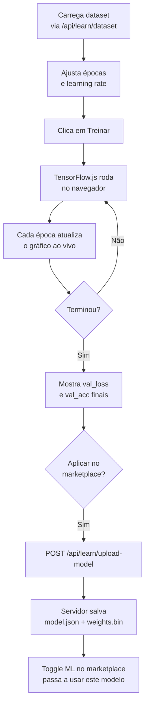

**Experimentos recomendados:**

| Experimento | Configuração | O que observar |
|-------------|-------------|----------------|
| Baseline | 30 épocas, lr 0.01 | Convergência normal |
| Overfit | 80 épocas, lr 0.05 | `val_loss` sobe enquanto `loss` cai |
| Underfit | 5 épocas, lr 0.001 | Ambas as curvas altas |
| Estável | 20 épocas, lr 0.005 | Curvas próximas |

Abaixo do playground, a **tabela de pares de treino** mostra exemplos concretos do dataset:

| Usuário | Produto | Atributos | Label |
|---------|---------|-----------|-------|
| Maria Silva | Vaso Geométrico | decorative · PLA | Comprou |
| Maria Silva | Suporte de Monitor | functional · PETG | Não comprou |

Isso torna tangível o que é "um exemplo supervisionado".

### Aba 4 — Comparar

Executa as duas fases lado a lado para a mesma persona:

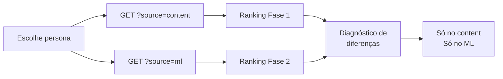

A seção de diferenças responde à pergunta central: **os dois algoritmos concordam?** Quando divergem, é ponto de discussão — a rede aprendeu algo que o cosseno não captura, ou apenas memorizou?

### APIs do laboratório

| Endpoint | Retorna |
|----------|---------|
| `GET /api/learn/dataset` | Dataset completo com split treino/validação |
| `GET /api/learn/vectors?email=` | Vetor do perfil + histórico de compras |
| `GET /api/learn/demo-users` | Personas disponíveis |
| `GET /api/learn/model-status` | Se existe modelo salvo + metadata |
| `GET /api/learn/training-pairs` | Pares (usuário, produto, label) legíveis |
| `GET /api/learn/recommendations?email=&source=` | Recomendações para comparação |
| `POST /api/learn/upload-model` | Recebe modelo treinado no browser |

> As rotas do laboratório aceitam apenas os e-mails das personas demo, evitando exposição de dados de outros usuários.

### Integração com o marketplace

O toggle no `/marketplace` fecha o ciclo entre laboratório e produto:

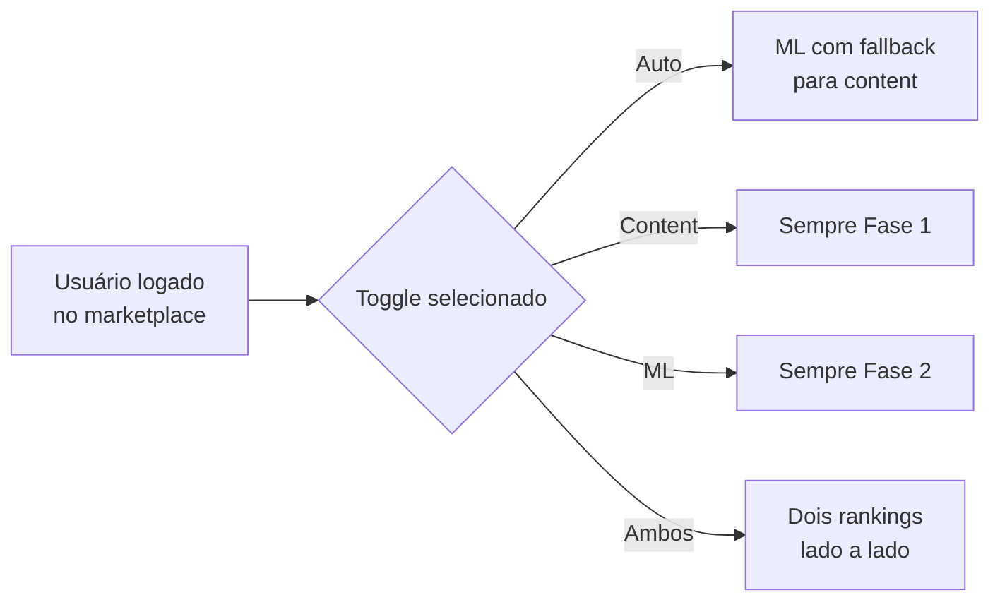

O modo **Ambos** é o mais didático para demonstração ao vivo: mostra as duas listas simultaneamente, com os scores de cada algoritmo.

---

## 8. Como rodar e testar

### Setup inicial

```bash
# 1. Banco de dados
docker compose up -d

# 2. Dependências e schema
npm install
npx prisma migrate dev --name init
npm run seed

# 3. Treinar o modelo da Fase 2 (opcional)
npm run recommendations:train

# 4. Rodar
npm run dev
```

### Logins demo

| Email | Senha | Comportamento |
|-------|-------|---------------|
| `maria@demo.com` | `demo123` | Decorativos / PLA |
| `joao@demo.com` | `demo123` | Funcionais / ABS |
| `maker1@demo.com` | `demo123` | Sem histórico → populares |

### Roteiro de demonstração (10 minutos)

```mermaid
flowchart TD
    A["1. /marketplace sem login<br/>Mais populares"] --> B["2. Login Maria<br/>Decorativos aparecem"]
    B --> C["3. Toggle Ambos<br/>Content vs ML"]
    C --> D["4. Logout → Login João<br/>Ranking muda"]
    D --> E["5. Abrir produto<br/>Similares + preview 3D"]
    E --> F["6. /learn → Vetores<br/>Por que os rankings diferem"]
    F --> G["7. /learn → Treino<br/>model.fit ao vivo"]
    G --> H["8. Aplicar no marketplace<br/>Ciclo completo"]
```

### API — parâmetros

```
GET /api/recommendations
  ?mode=personalized|similar|popular
  &source=auto|ml|content
  &productId=<id>          # obrigatório se mode=similar
  &limit=<1..50>
  &excludeIds=1,2,3
```

Resposta:

```json
{
  "items": [
    { "id": 1, "title": "...", "score": 0.87, "category": "decorative", "...": "..." }
  ],
  "meta": {
    "mode": "personalized",
    "source": "ml",
    "modelVersion": "2026-08-01T23:59:57.832Z",
    "totalCandidates": 20,
    "generatedAt": "2026-08-02T12:00:00.000Z"
  }
}
```

### Testes

```bash
npm run test:unit
```

Cobrem: `encode`, `similarity`, `training-data` (leave-one-out, labels, split por usuário), `model` (arquitetura e shape de predição) e `quiz-questions` (integridade das perguntas e distribuição das respostas).

### Problemas comuns

| Sintoma | Causa | Solução |
|---------|-------|---------|
| Página sem CSS | Cache `.next` corrompido | `rm -rf .next && npm run dev` |
| `Variable ... already registered` | Hot reload do TF.js | Reiniciar o dev server |
| Toggle ML retorna 503 | Modelo não treinado | `npm run recommendations:train` |
| `tfjs-node` não instala | Binários nativos | Usar `@tensorflow/tfjs` (padrão) |

---

## 9. Estrutura de código

```
src/
├── lib/recommendations/
│   ├── constants.ts          # Pesos das features, status de pedido, tipos de source
│   ├── types.ts              # Interfaces compartilhadas
│   ├── context.ts            # Fase 1: min/max, índices de categoria e material
│   ├── encode.ts             # Fase 1: produto → vetor, usuário → vetor, cold start
│   ├── similarity.ts         # Fase 1: cosseno, normalização, one-hot, média
│   ├── queries.ts            # Prisma: produtos, histórico, usuários com compras
│   ├── recommend.ts          # Orquestração: escolhe algoritmo, ranqueia, formata
│   ├── training-data.ts      # Fase 2: leave-one-out, pares + labels, split
│   ├── model.ts              # Fase 2: arquitetura, treino, predict em lote
│   ├── model-loader.ts       # Fase 2: salvar/carregar modelo e metadata
│   ├── ml-recommend.ts       # Fase 2: inferência e ranking por score
│   ├── tensorflow.ts         # Abstração tfjs vs tfjs-node
│   ├── browser-model.ts      # Laboratório: treino no navegador + upload
│   ├── learn-data.ts         # Laboratório: dataset, vetores, pares legíveis
│   ├── feature-descriptions.ts # Laboratório: textos das tooltips
│   └── quiz-questions.ts     # Laboratório: 4 trilhas de perguntas + rotação
│
├── app/api/
│   ├── recommendations/route.ts    # API pública de recomendações
│   └── learn/                      # APIs do laboratório
│       ├── dataset/route.ts
│       ├── vectors/route.ts
│       ├── demo-users/route.ts
│       ├── model-status/route.ts
│       ├── training-pairs/route.ts
│       ├── recommendations/route.ts
│       └── upload-model/route.ts
│
├── app/learn/page.tsx        # Rota do laboratório
│
├── components/
│   ├── recommendations-section.tsx  # Carrossel + toggle Auto/Content/ML/Ambos
│   ├── similar-products.tsx         # Produtos similares
│   └── learn/
│       ├── learn-lab.tsx            # Abas e orquestração
│       ├── vector-explorer.tsx      # Aba Vetores
│       ├── training-playground.tsx  # Aba Treino TF
│       ├── recommendation-comparator.tsx # Aba Comparar
│       ├── dataset-explorer.tsx     # Tabela de pares
│       ├── learn-quiz.tsx           # Quiz por trilhas + correção
│       ├── learning-missions.tsx    # Missões + persistência
│       └── charts.tsx               # Gráficos SVG (loss e vetor)
│
└── scripts/
    └── train-recommendation-model.ts  # CLI: npm run recommendations:train

models/recommendations/       # Gerado pelo treino (gitignored)
├── model.json
├── weights.bin
└── metadata.json
```

### Mapa fase → arquivos

```mermaid
flowchart LR
    subgraph F1["Fase 1"]
        A1[context.ts]
        A2[encode.ts]
        A3[similarity.ts]
    end

    subgraph F2["Fase 2"]
        B1[training-data.ts]
        B2[model.ts]
        B3[model-loader.ts]
        B4[ml-recommend.ts]
    end

    subgraph LAB["Laboratório"]
        C1[learn-data.ts]
        C2[browser-model.ts]
        C3[feature-descriptions.ts]
    end

    subgraph ORQ["Orquestração"]
        D1[recommend.ts]
        D2[queries.ts]
    end

    A1 --> A2 --> A3 --> D1
    A2 --> B1 --> B2 --> B3 --> B4 --> D1
    A2 --> C1
    B1 --> C1
    B2 --> C2
    D2 --> D1
```

---

## 10. Referências

### Documentação interna

- [OVERVIEW.md](./OVERVIEW.md) — mapeamento de features e pontos de integração
- [Fase 1 — Plano](./phase-01-content-based/plan.md) · [Spec](./phase-01-content-based/spec.md)
- [Fase 2 — Plano](./phase-02-neural-network/plan.md) · [Spec](./phase-02-neural-network/spec.md)
- [Fase 3 — Plano](./phase-03-advanced/plan.md) · [Spec](./phase-03-advanced/spec.md)
- [prisma/schema.prisma](../../prisma/schema.prisma) — modelos de dados

### Referência externa (curso)

Pipeline base: `modulo01-fundamentos-de-ia-e-llms-para-programadores/exemplo-01-ecommerce-recomendations-z/parte05-ecommerce-recomendations-with-tensorflow/src/workers/modelTrainingWorker.js`

Diferenças em relação ao demo original:

| Aspecto | Demo do curso | Este projeto |
|---------|--------------|--------------|
| Dados | JSON estático (5 usuários, 10 produtos) | PostgreSQL via Prisma |
| Execução | Web Worker no navegador | API Route + script CLI + navegador |
| Leave-one-out | Ausente (vazamento) | Implementado |
| Split | Aleatório por linha | Por usuário |
| Arquitetura | 128 → 64 → 32 | 64 → 32 → 1 (menor, menos dados) |
| Fallback | Nenhum | Content-based e populares |
| Camada educacional | Nenhuma | Rota `/learn` completa |

### Glossário

| Termo | Significado |
|-------|-------------|
| **Vetor** | Lista de números que representa produto ou usuário |
| **Encode** | Converter dados em vetor |
| **One-hot** | Codificação onde só a posição da categoria correta recebe valor |
| **Cosseno** | Medida de similaridade entre vetores (0 a 1) |
| **Label** | Rótulo do exemplo: 1 = comprou, 0 = não comprou |
| **Leave-one-out** | Excluir o item rotulado do perfil, evitando vazamento |
| **Overfit** | Modelo memoriza o treino e falha em dados novos |
| **Early stopping** | Parar o treino quando a validação para de melhorar |
| **Cold start** | Usuário ou produto sem histórico |
| **Embedding** | Vetor gerado por modelo que captura significado do texto |
| **Two-tower** | Duas redes separadas (usuário e produto) comparadas por similaridade |
| **ANN** | Busca aproximada de vizinhos mais próximos, para escala |
| **pgvector** | Extensão do PostgreSQL para armazenar e buscar vetores |
